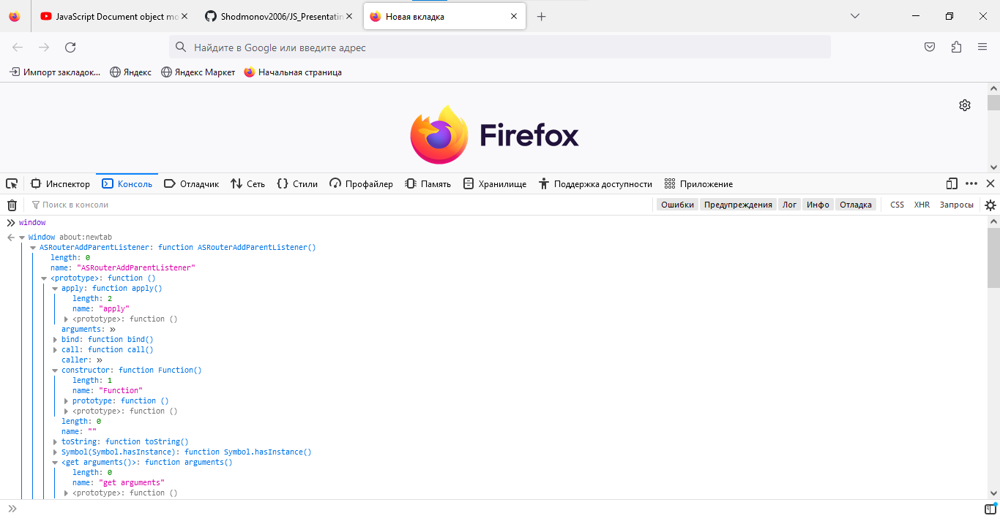
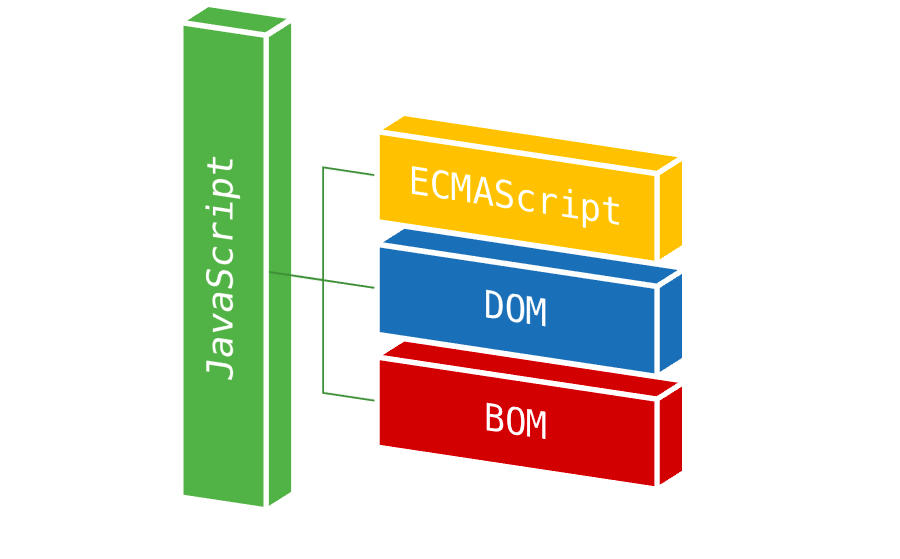
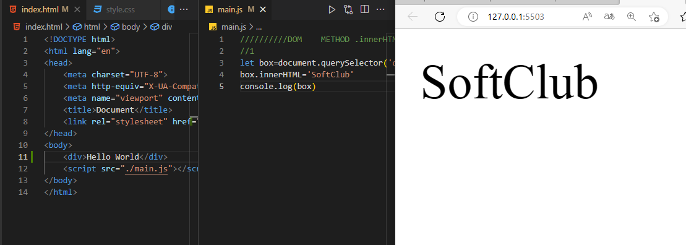

# JS_Presentatin6

## Table of contents
> - 1)DOM
>
> - 2)BOM
> 
> - 3)EVENTS
> 
> - 4) DOM METHOD

## Windiws
>
> 
>
> 

## What is DOM in JavaScript?
> Объектная модель документа (DOM) — это программный интерфейс для веб-документов. Он представляет страницу, чтобы программы могли изменять структуру, стиль и содержимое документа. DOM представляет документ в виде узлов и объектов; таким образом, языки программирования могут взаимодействовать со страницей.
>
> 

## DOM
> According to the Document Oblect Modul , every HTML tag is an object. Subtags are "children of the parent elment. The text that is inside the tag is also an object. All these objects are avaolable with JavaScript, we can use them to modify the page
>
> - JavaScript can modify all HTML elements on a page.
> - JavaScript can change all HTML attributes on a page.
> - JavaScript can change all CSS styles on a page.
> - JavaScript can remove existing HTML elements and attributes.
> - JavaScript can add new HTML elements and attributes.
> - JavaScript can respond to all existing HTML events on the page.
> - JavaScript can fire new HTML events on a page
> 
>Definition and Usage. The querySelector() method returns the first child element that matches a
specified CSS selector(s) of an element, querySelectorAll() method can be used to access all elements
which match with a specified CSS selector.

> ## array methods
> innerHTML - Это свойство предоставляет простой способ полностью
заменить содержимое элемента. Например, все содержимое
элемента body может быть удалено:
>
> 
>
> The Style object represents an
individual style statement

## Html events …
> An HTML event can be something the
browser does, or something a user does.
Here are some examples of HTML events:
>
> - An HTML web page has finished loading
> - An HTML input field was changed
> - An HTML button was clicked
>
> JavaScript lets you execute code when events are detected.
> - onclick                 The user clicks an HTML element

## createElement()
> Метод JavaScript document.createElement() позволяет создавать и возвращать
новый элемент (пустой узел элемента) с указанным именем тега.
> - 1) createElement(elementName): создает элемент html, тег которого
передается как параметр. Возвращает созданный элемент

## Html events
>
> ### HTML DOM Element appendChild()
> Метод appendChild() добавляет узел (элемент) в качестве последнего дочернего элемента элемента.
AppendChild() добавляет узел в конец списка дочерних элементов указанного родительского узла. Если данный дочерний элемент является ссылкой на существующий узел в документе, то функция appendChild() переводит его из текущей позиции в новую позицию.
>
> ### to create a peragraph with a text.
>
> - Create a paragraph element
> - Create a text node
> - Append the text node to the paragraph
> - Append the paragraph to the document
>
> 

## classlist()
> ClassList is a getter. The object it returns has several methods:
> - add( String [,String] )
  Adds the specified classes to the element
> - remove( String [,String] )
  Removes the specified classes from the element
> - toggle(String[, Boolean])
  If the element has no class, it adds it, otherwise it removes it. When
  false is passed as the second parameter, it removes the specified
  class, and if true, it adds it.
>
> If the second parameter is undefined or a variable with
  typeof == 'undefined', the behavior is the same as passing only the
  first parameter when calling